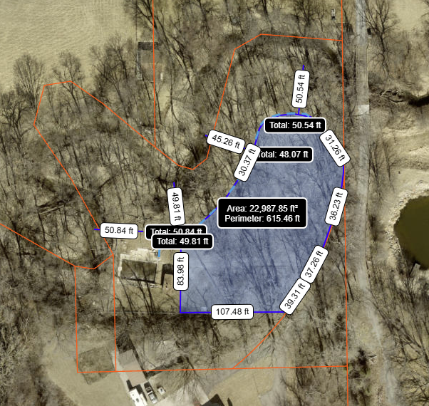

Not part of the Embris final report, but as **speculative** follow-up, the Board probed more into
the possibility of replacing the WWTF with a combined septic system for the entire SID.

<a href="/about/#wastewater-treatment-facility-wwtf">About our Wastewater Treatment Facility</a>
(WWTF).

Email correspondence:

I did ask about whether there was enough room for a combined septic system at
the current WWTF location and below is the answer I received.  In summary "It
may not be able to be completely eliminated, but I do consider it doubtful that
it would be feasible."

I did do a cursory look at available property.  The surface water setback would
commonly be established from the ordinary high water level mark (not middle of
stream).  I roughed out in Dogis and came up with the following.  This
obviously would require significant tree clearing and root intrusion for the
construction of the lateral field could potentially be an issue.  The lateral
field also has to be installed generally flat which would require grading work
to be done (6-7 feet of fall across this area). Depending on the soil
conditions and the percolation rate, you may be able to make it work if we are
on the low end of the needed lateral field area.
But anything approaching 1/2 - 3/4 acre would be very difficult to site.  It may
not be able to be
completely eliminated, but I do consider it doubtful that it would be feasible.
A soil percolation test would go a long ways to identify the feasibility of
this.

In addition, it did look like either there is a large encroachment on the south
side of the SID’s property by the neighbor, or the property lines shown may not
be accurate?  Please feel free to reach out with any additional questions.
Happy to answer them.

<!-- img src="{{image}}" alt="exploring combined septic"-->

