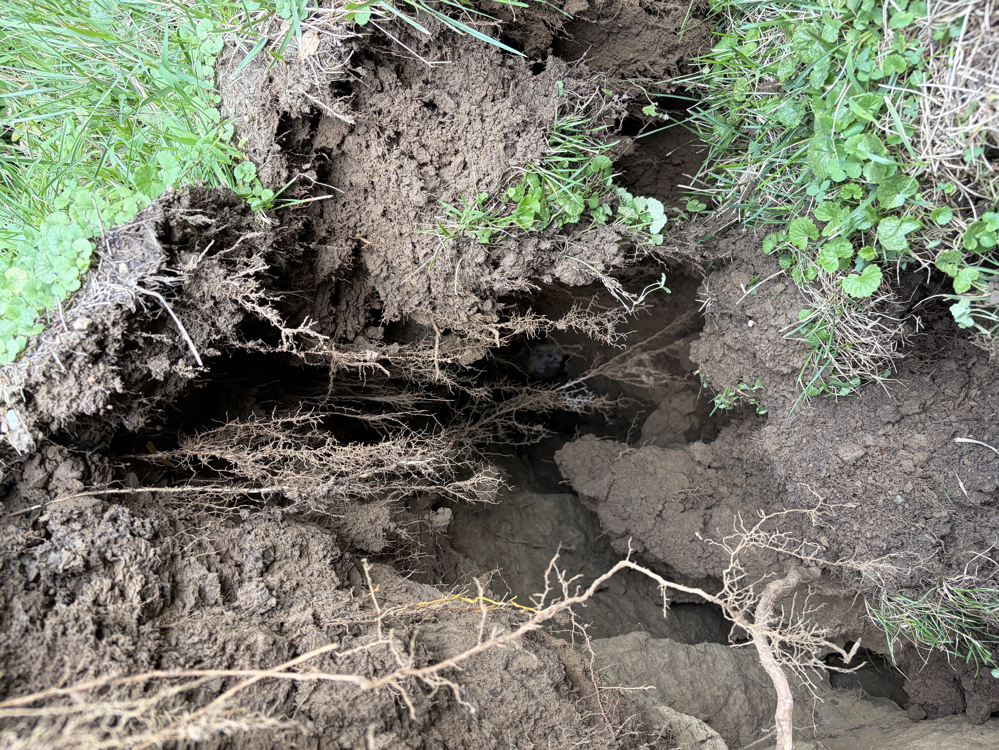
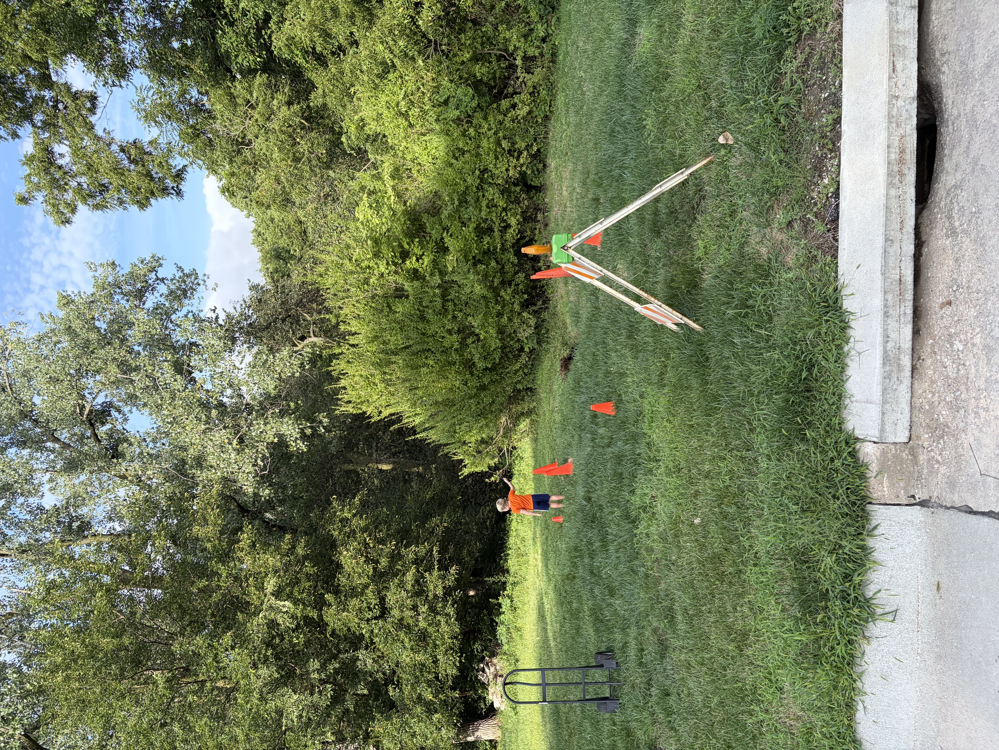

Today a sinkhole opened up under and around the SID 128 storm drain pipe that conveys water from the low spot on North 40th (right at the bottom of the hill) to the drainage ditch.  There is a significant hole in the 50+ year old, approx 30-inch diameter corrugated metal pipe immediately east of the roadway and that rainwater is exiting this hole and is undermining the storm drain pipe.  The sinkhole is of significant size and is moving towards the road though it is not to the road.  An SID resident and I staked and taped off the area with caution tape.  Within the caution tape, there's about an 8 foot by 4 foot by 4 foot cavern that could cave in and poses a significant danger.

Recommended course of action is to get quotes to dig out the existing pipe, line with rock, and replace the approximately 60 feet of 30" storm drain pipe with either corrugated metal pipe or HDPE.  This is an urgent repair as additional heavy rain events will cause more undermining, which could migrate to the road.

Inspection of the storm drain (including under the street) scheduled for 8-10am on 26 August.

